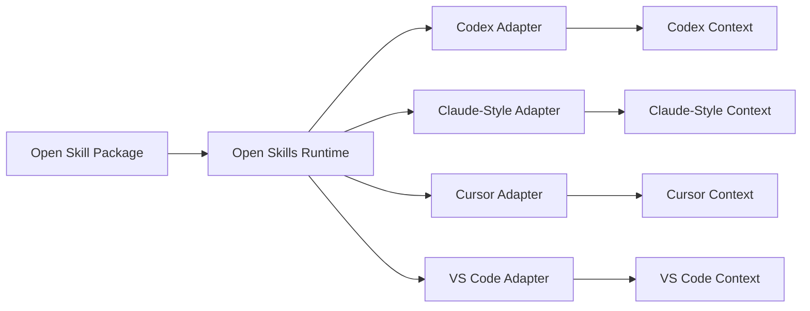
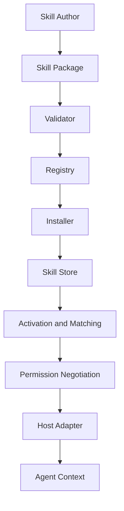
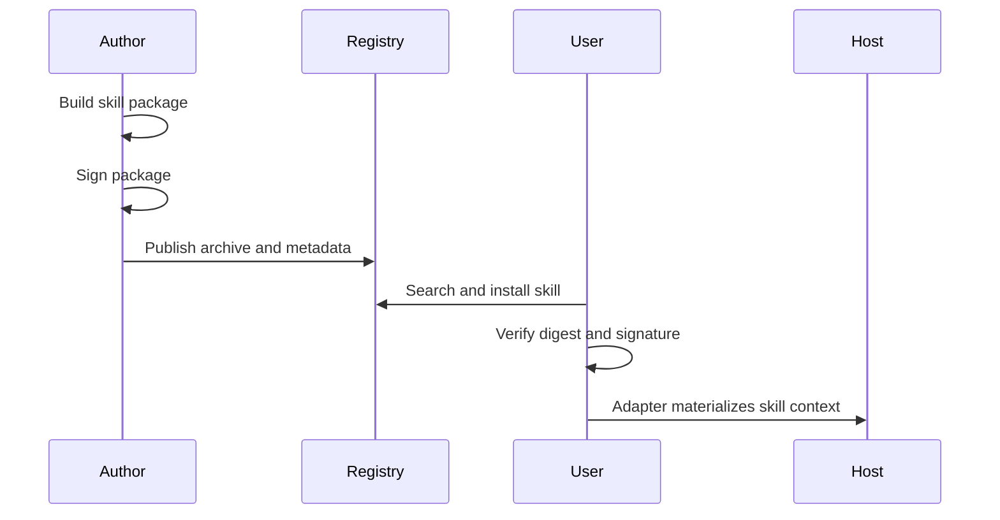

# Open Skills


Open Skills is a universal framework for portable AI agent skills.

The project exists because agent skills should not be locked to one IDE, model provider, or coding assistant. A skill should be authored once, validated once, and then adapted into tools such as Codex, Claude Code-style runtimes, Cursor, VS Code, or future agent hosts.

## Problem

Modern coding assistants can use reusable instructions, workflows, scripts, references, and assets. But these skills are usually tied to one host environment.

That creates several problems:

- Skills are hard to reuse across IDEs and agents.
- Users cannot easily inspect why a skill activated.
- Teams have no common packaging, validation, or permission model.
- Marketplaces become vendor-specific instead of ecosystem-wide.
- Installed skill folders can bloat project repositories if there is no shared runtime/store model.

Open Skills separates the portable skill package from the host-specific runtime.

## Core Idea

A skill has a portable core and host-specific adapters.



The portable package contains the reusable knowledge. The adapter converts that package into the format and permission model expected by a specific host.

## Skill Package

A minimal skill is a folder with a `SKILL.md` file.

```text
my-skill/
  SKILL.md
  references/
  scripts/
  assets/
```

`SKILL.md` contains metadata and instructions:

```yaml
---
name: hello-skill
description: A minimal example skill.
version: 0.1.0
spec_version: 0.1
capabilities: [read_files]
triggers:
  - inspect skill metadata
permissions:
  - read_files:workspace:allow
hosts: [codex, cursor, vscode, claude-code]
---
```

The metadata helps the runtime discover, validate, match, and safely materialize the skill.

## Architecture



The main runtime responsibilities are:

| Layer | Responsibility |
| --- | --- |
| Loader | Parse `SKILL.md` and package metadata |
| Validator | Check package structure, names, triggers, and permissions |
| Registry | Publish, search, and install skill packages |
| Signing | Produce and verify package digests and signatures |
| Adapter | Convert portable skills into host-specific context |
| Codex Adapter | Render Open Skills into Codex-ready prompt/context payloads |

## Why Open Skills Is Better

Open Skills is designed around portability, transparency, and host neutrality.

| Area | Host-Specific Skills | Open Skills |
| --- | --- | --- |
| Portability | Usually tied to one assistant or IDE | Designed to work across multiple hosts |
| Package format | Host-specific conventions | Common `SKILL.md` package contract |
| Activation | Often implicit or opaque | Trigger and metadata driven, with room for explainable matching |
| Permissions | Mostly host-defined | Skill-declared permissions plus host negotiation |
| Installation | Often copied into one tool or repo | Registry/install model with version pinning |
| Trust | Platform-dependent | Package digests, public-key signatures, and provenance metadata |
| Adapters | Not reusable across hosts | Thin host adapters over a shared runtime |

The goal is not to replace every IDE integration. The goal is to give every IDE and coding agent a common skill substrate.

## Installation

This project currently uses Python and has no required runtime dependencies outside the standard library.

Install in editable mode:

```bash
python3 -m pip install -e .
```

Run directly from the repository:

```bash
python3 -m open_skills.cli --help
```

If installed as a package, the console command is:

```bash
open-skills --help
```

## Basic Usage

List skills:

```bash
python3 -m open_skills.cli list ./skills
```

Inspect metadata:

```bash
python3 -m open_skills.cli inspect ./skills/hello-skill
```

Validate a package:

```bash
python3 -m open_skills.cli validate ./skills/hello-skill
```

Activate skills for a task:

```bash
python3 -m open_skills.cli activate "inspect skill metadata" --skills-dir ./skills --host codex --explain
```

Render a skill for Codex:

```bash
python3 -m open_skills.cli codex render ./skills/hello-skill
```

Search a registry:

```bash
python3 -m open_skills.cli search hello --registry .open-skills/registry
```

Install a skill:

```bash
python3 -m open_skills.cli install hello-skill --registry .open-skills/registry
```

## Trust And Distribution

Open Skills supports package digests, public-key signatures, provenance metadata, zip-based registry releases, and install lockfiles.



Generate a keypair:

```bash
python3 -m open_skills.cli keygen \
  --signer local-dev \
  --private-key .open-skills/local-dev.private.json \
  --public-key .open-skills/local-dev.public.json
```

Sign and verify:

```bash
python3 -m open_skills.cli sign ./skills/hello-skill \
  --signer local-dev \
  --private-key .open-skills/local-dev.private.json \
  --provenance repository=https://example.com/open-skills

python3 -m open_skills.cli verify ./skills/hello-skill \
  --public-key .open-skills/local-dev.public.json
```

Important: the current pure-Python RSA implementation proves the trust model, but production releases should use an audited signing stack such as `cryptography`, Sigstore, or Minisign.

## Repository Layout

```text
docs/
  adapters.md
  architecture.md
  spec.md
open_skills/
  __init__.py
  activation.py
  adapters.py
  cli.py
  codex_adapter.py
  loader.py
  models.py
  registry.py
  signing.py
  validator.py
skills/
  hello-skill/
    SKILL.md
TODO.md
pyproject.toml
```

## Current Status

Open Skills currently includes:

- A portable `SKILL.md` package format.
- Explainable skill activation with host filters and activation thresholds.
- Metadata parsing for triggers, permissions, hosts, capabilities, and dependencies.
- Package validation.
- Local and remote registry index support.
- Publish, search, and install commands.
- Zip release artifacts and install lockfiles.
- Public-key package signing and verification.
- A Codex adapter that renders portable skills into Codex-ready context.

The project is still early. The main product priority is improving the core skill runtime: activation quality, progressive context loading, authoring tools, adapter consistency, and permission UX.

See [TODO.md](/home/kedar/Desktop/Projects/open-skills/TODO.md) for the detailed implementation plan.
